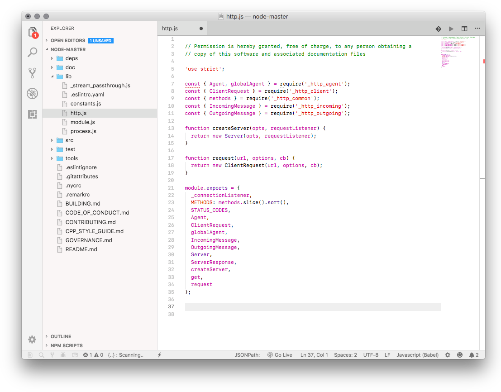
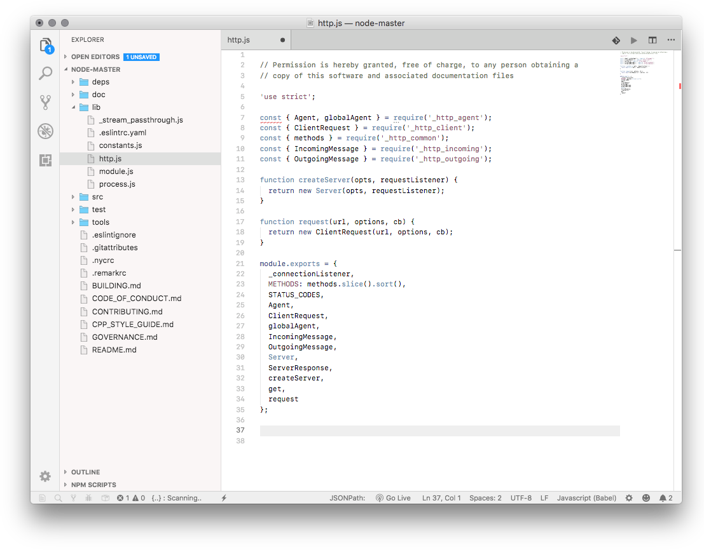

# MacOS Modern Theme

MacOS Modern is a light Visual Studio Code theme styled to match native MacOS as closely as possible.  Two color scheme variants and an icon theme are included. I HIGHLY recommend using the settings below for best results.

**MacOS Modern - Xcode Low Key** + **MacOS Modern Minimal Icons**


**MacOS Modern - Xcode Default** + **MacOS Modern - Color Icons**


**MacOS Modern - Xcode Low Key** + **MacOS Modern - Color Icons**


---

## Setup & Tweaks 

There are a few settings that should be added to your User Settings to really transform the look to better match OS X.  The zoom level and native title bar make a huge difference in the overall look of VSCode.  I also prefer to hide the Activity Bar, which can be done from the View menu.

### Highly Recommended

```json
 // MacOS Modern Tweaks
"window.titleBarStyle": "native",
"window.nativeTabs": true,
"window.zoomLevel": -0.5,
"workbench.iconTheme": "macos-modern-color-icon-theme",
"editor.fontSize": 12,
"editor.fontFamily": "SF Mono, Monaco",
"editor.tabSize": 2,
"editor.fontWeight": "normal",

// Disable Tab File Icons
"workbench.editor.showIcons": false,
// Disable Red Sidebar Errors
"problems.decorations.enabled": false,

```

### Extension Tweaks
If you choose to hide the activity bar, you can install the "Activitus Bar" extension to add the activity bar buttons to your status bar.  Add these settings to theme the "Activitus Bar" and "Project Manager" extensions to match Modern MacOS.

```json
 // Activitus Bar
"activitusbar.activeColour": "#615F61",
"workbench.activityBar.visible": true,

// Project Manager
"projectManager.treeview.visible": false,
```

### Optional Additions
You can optionally hide the minimap.

```    json
// Disable Minimap
"editor.minimap.enabled": false,

```

### Activity Bar Badge Background
You can change the activity bar badge background with these settings. Add the line for the color you want to `workbench.colorCustomizations`

```json
// Workbench Color Tweaks
"workbench.colorCustomizations": {
  "activityBarBadge.background": "#1a8bfb", // blue
  "activityBarBadge.background": "#f84339", // red
},
```

---

## Extras

Light and dark VSCode icons are also included in full quality (don't use the small preview below) in the extension folder in:  
`~/.vscode/extensions/davidbwaters.macos-modern-theme/extras`  
You could also download the files from the repo [folder](https://github.com/davidbwaters/macos-modern-vscode-theme/tree/master/extras) by clicking the name of the `icns` or `png` and clicking the "Download" button. You can use the free app [LiteIcon](https://freemacsoft.net/liteicon/) to change the icon.

 
